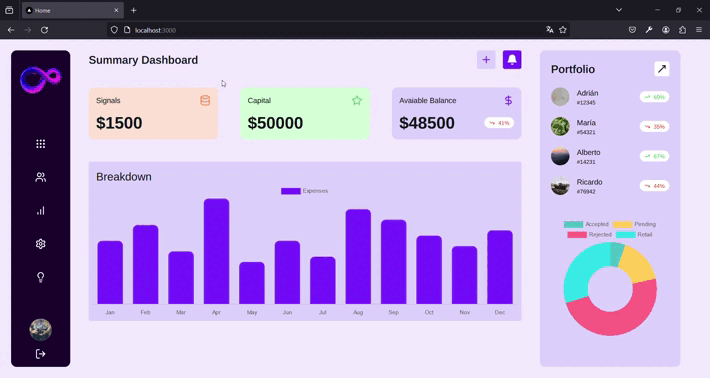

* SAAS aplication

Hello everyone, today I'm uploading a project to GitHub that I created to practice with Next.js, Zustand, and JavaScript charts. It's a SaaS application for which, currently, the data is randomly generated (I'll add a backend in the future). If you'd like to collaborate, feel free to do so. Thanks and greetings.

